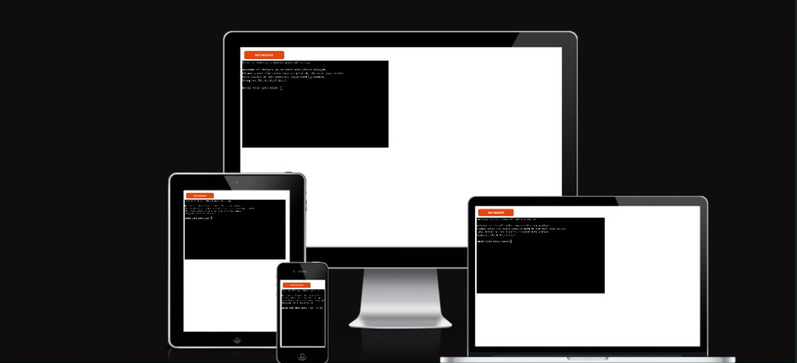

# LOVE SANDWISH
This Python program automates the process of managing sales, stock, and surplus data for a sandwich store by integrating with Google Sheets. The system allows the user to input sales data, automatically calculates surplus (which represents the difference between stock and sales), and updates the relevant Google Sheets accordingly. Additionally, the program computes future stock needs based on the last five entries of sales data, accounting for a 10% buffer in stock calculations.
 Here is the link to Love Sandwish-heroku where employee details are entered [link](https://love-sandwishe-c46827efa140.herokuapp.com/)

 

 ## How to access the Love Sandwish Data Automation:
 - Enter the [link](https://love-sandwishe-c46827efa140.herokuapp.com/) alternatively you can also copy the link: `https://love-sandwishe-c46827efa140.herokuapp.com/` and paste it in the browser.
- Wait for the page to load and then you click 'RUN PROGRAM'.
- Choose from the options displayed.
1.  Enter sales data.
2.  Automatically, both the sales,surplus and stock update on the google sheet.
3.  Exit.
Python extension loading...